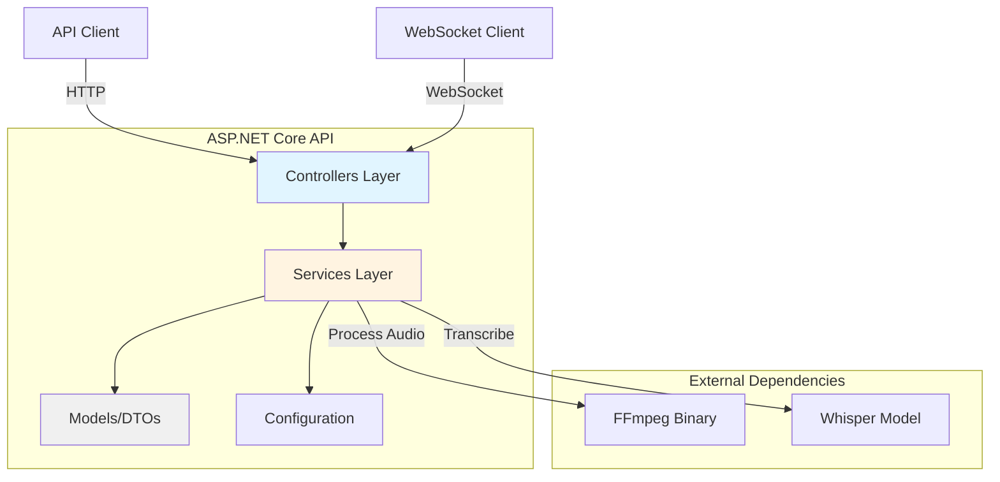
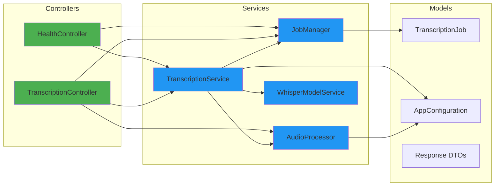
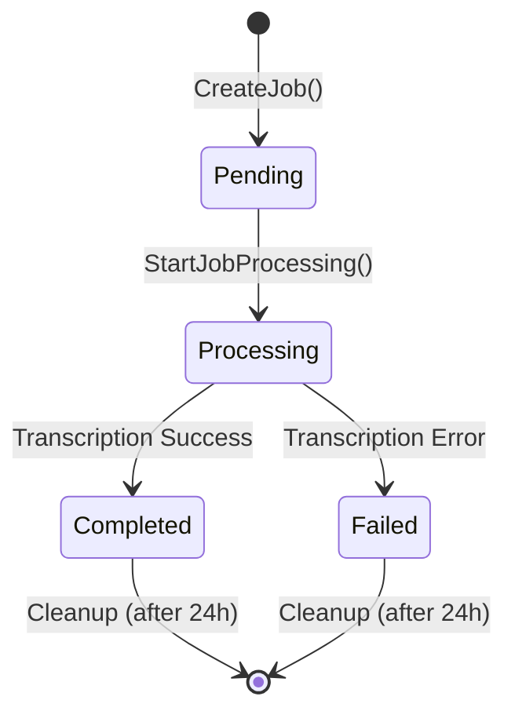
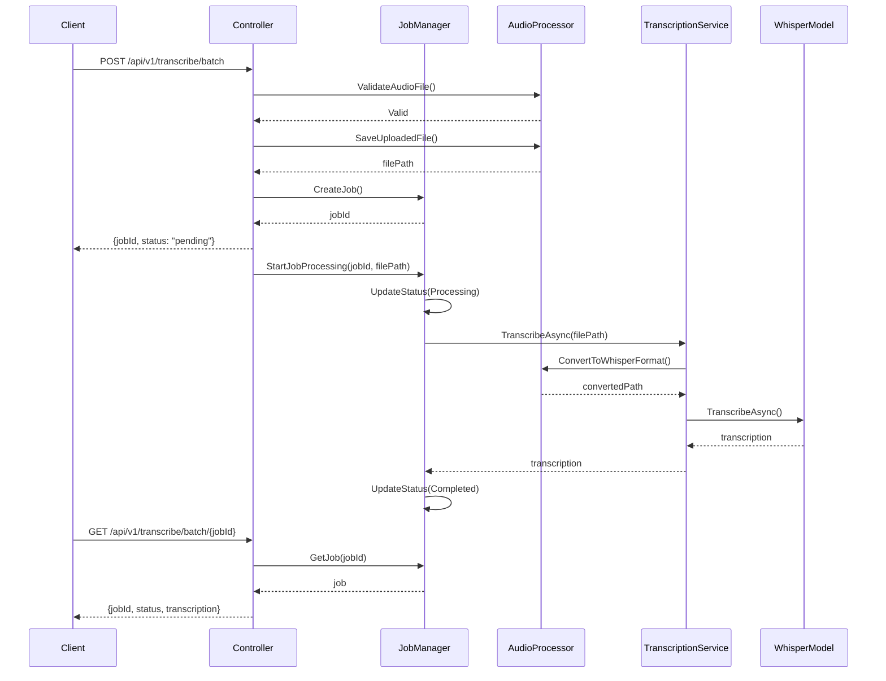
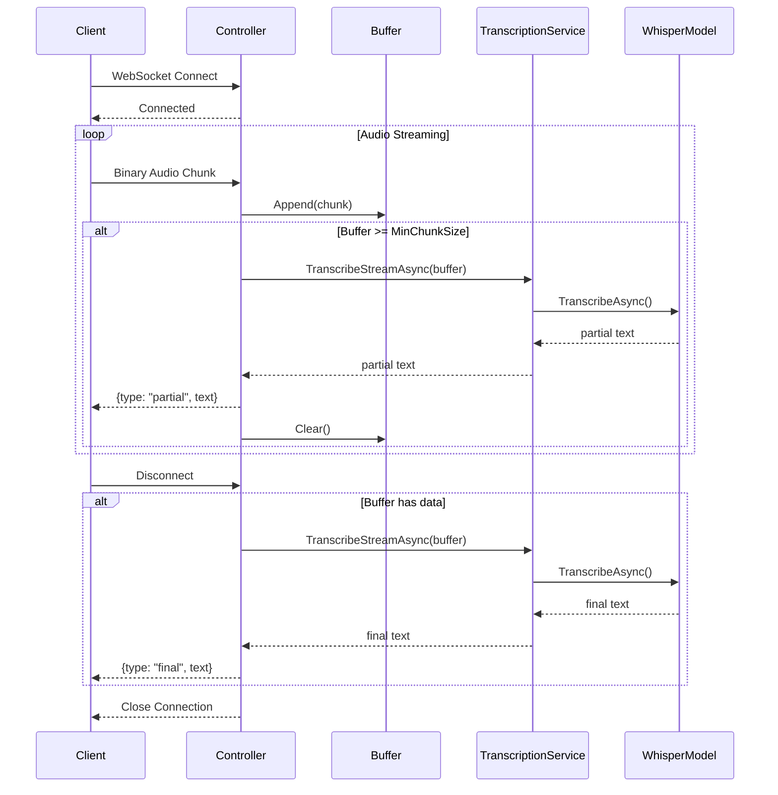

# Design Document: ASP.NET Core Transcription API

## 1. Overview

This design document describes the architecture and implementation approach for porting the Python FastAPI Persian Transcription API to ASP.NET Core. The system provides both batch and streaming audio transcription capabilities using the Whisper model, with proper job management, capacity control, and error handling.

### Key Design Goals

- **Idiomatic .NET**: Use standard ASP.NET Core patterns and practices
- **Separation of Concerns**: Clear boundaries between controllers, services, and models
- **Thread Safety**: Concurrent job processing with proper synchronization
- **Resource Management**: Efficient handling of audio files, model memory, and worker threads
- **Extensibility**: Easy to add new features or swap implementations

### Technology Stack

- **ASP.NET Core 8.0+**: Web API framework
- **FFMpegCore**: Audio processing and conversion
- **Whisper.net**: Whisper model integration for transcription
- **Built-in DI**: Dependency injection container
- **ILogger**: Structured logging

## 2. Architecture

### 2.1 High-Level Architecture



### 2.2 Component Architecture



### 2.3 Layer Responsibilities

**Controllers Layer**
- Handle HTTP requests and WebSocket connections
- Validate request parameters
- Map between DTOs and service models
- Return appropriate HTTP status codes
- Handle exceptions and format error responses

**Services Layer**
- Implement business logic
- Manage transcription workflow
- Coordinate between components
- Handle concurrency and thread safety
- Manage resource lifecycle

**Models Layer**
- Define data structures
- Represent job state
- Configuration settings
- DTOs for API responses

## 3. Components and Interfaces

### 3.1 Controllers

#### HealthController

```csharp
[ApiController]
[Route("api/v1")]
public class HealthController : ControllerBase
{
    private readonly IWhisperModelService _modelService;
    private readonly IJobManager _jobManager;
    
    [HttpGet("health")]
    public ActionResult<HealthResponse> GetHealth();
    
    [HttpGet("capacity")]
    public ActionResult<CapacityResponse> GetCapacity();
}
```

**Responsibilities:**
- Return service health status
- Report model loading state
- Provide capacity information
- Return 503 when service unavailable

#### TranscriptionController

```csharp
[ApiController]
[Route("api/v1/transcribe")]
public class TranscriptionController : ControllerBase
{
    private readonly ITranscriptionService _transcriptionService;
    private readonly IJobManager _jobManager;
    private readonly IAudioProcessor _audioProcessor;
    
    [HttpPost("batch")]
    public async Task<ActionResult<BatchTranscriptionResponse>> SubmitBatchJob(
        IFormFile audioFile);
    
    [HttpGet("batch/{jobId}")]
    public ActionResult<JobStatusResponse> GetJobStatus(string jobId);
}
```

**Responsibilities:**
- Accept audio file uploads
- Validate file format and size
- Create transcription jobs
- Return job status
- Handle capacity limits

#### StreamingTranscriptionController

```csharp
public class StreamingTranscriptionController : ControllerBase
{
    private readonly ITranscriptionService _transcriptionService;
    
    [Route("/api/v1/transcribe/stream")]
    public async Task HandleWebSocket();
}
```

**Responsibilities:**
- Accept WebSocket connections
- Receive binary audio chunks
- Buffer audio data
- Send partial transcription results
- Finalize transcription on disconnect

### 3.2 Services

#### ITranscriptionService

```csharp
public interface ITranscriptionService
{
    Task<string> TranscribeAsync(string audioFilePath, CancellationToken ct);
    Task<string> TranscribeStreamAsync(byte[] audioData, CancellationToken ct);
    bool IsModelLoaded { get; }
    string ModelSize { get; }
}
```

**Implementation: TranscriptionService**

```csharp
public class TranscriptionService : ITranscriptionService
{
    private readonly IWhisperModelService _modelService;
    private readonly IAudioProcessor _audioProcessor;
    private readonly ILogger<TranscriptionService> _logger;
    private readonly SemaphoreSlim _workerSemaphore;
    
    public async Task<string> TranscribeAsync(string audioFilePath, CancellationToken ct)
    {
        // 1. Convert audio to Whisper format
        // 2. Acquire worker slot
        // 3. Transcribe using Whisper model
        // 4. Release worker slot
        // 5. Clean up temp files
        // 6. Return transcription text
    }
    
    public async Task<string> TranscribeStreamAsync(byte[] audioData, CancellationToken ct)
    {
        // 1. Save audio data to temp file
        // 2. Convert to Whisper format
        // 3. Transcribe
        // 4. Clean up temp files
        // 5. Return transcription text
    }
}
```

**Responsibilities:**
- Coordinate transcription workflow
- Manage worker concurrency using semaphore
- Handle audio conversion
- Invoke Whisper model
- Clean up temporary files
- Log transcription events

#### IJobManager

```csharp
public interface IJobManager
{
    string CreateJob();
    TranscriptionJob? GetJob(string jobId);
    void UpdateJobStatus(string jobId, JobStatus status, string? result = null, string? error = null);
    int GetActiveJobCount();
    int GetQueuedJobCount();
    bool IsAtCapacity();
    Task StartJobProcessingAsync(string jobId, string audioFilePath);
}
```

**Implementation: JobManager**

```csharp
public class JobManager : IJobManager
{
    private readonly ConcurrentDictionary<string, TranscriptionJob> _jobs;
    private readonly ITranscriptionService _transcriptionService;
    private readonly ILogger<JobManager> _logger;
    private readonly AppConfiguration _config;
    private readonly Timer _cleanupTimer;
    
    public string CreateJob()
    {
        // 1. Generate unique job ID
        // 2. Create job with "pending" status
        // 3. Store in concurrent dictionary
        // 4. Return job ID
    }
    
    public async Task StartJobProcessingAsync(string jobId, string audioFilePath)
    {
        // 1. Update job status to "processing"
        // 2. Call transcription service
        // 3. Update job with result or error
        // 4. Clean up audio file
    }
    
    private void CleanupOldJobs()
    {
        // Remove jobs older than configured age
    }
}
```

**Responsibilities:**
- Thread-safe job creation and storage
- Job lifecycle management
- Track active and queued jobs
- Capacity checking
- Automatic cleanup of old jobs
- Background job processing

#### IAudioProcessor

```csharp
public interface IAudioProcessor
{
    Task<string> ConvertToWhisperFormatAsync(string inputPath, CancellationToken ct);
    bool IsValidAudioFile(IFormFile file);
    Task<string> SaveUploadedFileAsync(IFormFile file, CancellationToken ct);
}
```

**Implementation: AudioProcessor**

```csharp
public class AudioProcessor : IAudioProcessor
{
    private readonly ILogger<AudioProcessor> _logger;
    private readonly AppConfiguration _config;
    private static readonly string[] SupportedFormats = { ".wav", ".mp3", ".ogg", ".m4a" };
    
    public bool IsValidAudioFile(IFormFile file)
    {
        // 1. Check file extension
        // 2. Validate file size
        // 3. Check MIME type
        // 4. Return validation result
    }
    
    public async Task<string> ConvertToWhisperFormatAsync(string inputPath, CancellationToken ct)
    {
        // 1. Create temp output path
        // 2. Use FFMpegCore to convert:
        //    - 16kHz sample rate
        //    - Mono channel
        //    - WAV format
        //    - Audio normalization
        // 3. Return converted file path
    }
    
    public async Task<string> SaveUploadedFileAsync(IFormFile file, CancellationToken ct)
    {
        // 1. Generate temp file path
        // 2. Save uploaded file to disk
        // 3. Return file path
    }
}
```

**Responsibilities:**
- Validate audio file format and size
- Save uploaded files to temp directory
- Convert audio to Whisper format using FFmpeg
- Apply audio normalization
- Manage temporary file paths

#### IWhisperModelService

```csharp
public interface IWhisperModelService
{
    Task<string> TranscribeAsync(string audioFilePath, CancellationToken ct);
    Task LoadModelAsync();
    bool IsLoaded { get; }
    string ModelSize { get; }
}
```

**Implementation: WhisperModelService**

```csharp
public class WhisperModelService : IWhisperModelService, IDisposable
{
    private WhisperProcessor? _processor;
    private readonly AppConfiguration _config;
    private readonly ILogger<WhisperModelService> _logger;
    private readonly SemaphoreSlim _loadLock;
    
    public async Task LoadModelAsync()
    {
        // 1. Acquire load lock
        // 2. Check if already loaded
        // 3. Load Whisper model from disk or download
        // 4. Initialize processor
        // 5. Release lock
    }
    
    public async Task<string> TranscribeAsync(string audioFilePath, CancellationToken ct)
    {
        // 1. Ensure model is loaded
        // 2. Process audio file
        // 3. Extract transcription text
        // 4. Return result
    }
    
    public void Dispose()
    {
        // Clean up model resources
    }
}
```

**Responsibilities:**
- Load Whisper model on startup or first use
- Manage model lifecycle
- Perform transcription
- Thread-safe model access
- Resource cleanup

### 3.3 Models and DTOs

#### TranscriptionJob

```csharp
public class TranscriptionJob
{
    public string JobId { get; set; }
    public JobStatus Status { get; set; }
    public string? Transcription { get; set; }
    public string? Error { get; set; }
    public DateTime CreatedAt { get; set; }
    public DateTime? CompletedAt { get; set; }
}

public enum JobStatus
{
    Pending,
    Processing,
    Completed,
    Failed
}
```

#### Response DTOs

```csharp
public record HealthResponse(
    string Status,
    bool ModelLoaded,
    string ModelSize
);

public record CapacityResponse(
    int ActiveJobs,
    int QueuedJobs,
    int MaxWorkers,
    int MaxQueueSize,
    int AvailableCapacity,
    bool AtCapacity
);

public record BatchTranscriptionResponse(
    string JobId,
    string Status
);

public record JobStatusResponse(
    string JobId,
    string Status,
    string? Transcription,
    string? Error
);

public record StreamingMessage(
    string Type,  // "partial", "final", "error"
    string Text,
    double? Timestamp
);

public record ErrorResponse(
    ErrorDetail Error
);

public record ErrorDetail(
    string Code,
    string Message,
    string? Details
);
```

#### Configuration

```csharp
public class AppConfiguration
{
    public string WhisperModelSize { get; set; } = "medium";
    public int MaxConcurrentWorkers { get; set; } = 4;
    public int MaxQueueSize { get; set; } = 100;
    public int MaxFileSizeMB { get; set; } = 500;
    public string ApiHost { get; set; } = "0.0.0.0";
    public int ApiPort { get; set; } = 5000;
    public string LogLevel { get; set; } = "Information";
    public int JobCleanupMaxAgeHours { get; set; } = 24;
    public int StreamMinChunkSize { get; set; } = 102400;
    public int StreamMaxBufferSize { get; set; } = 10485760;
}
```

## 4. Data Models

### 4.1 Job State Machine



### 4.2 Data Flow - Batch Transcription



### 4.3 Data Flow - Streaming Transcription



### 4.4 Concurrency Model

The system uses multiple concurrency mechanisms:

1. **Worker Semaphore**: Limits concurrent transcription operations
   - Initialized with `MaxConcurrentWorkers` count
   - Acquired before transcription, released after completion
   - Prevents resource exhaustion

2. **ConcurrentDictionary**: Thread-safe job storage
   - Allows concurrent job creation and status updates
   - No explicit locking needed for basic operations

3. **Task-based Async**: Non-blocking I/O operations
   - File uploads and downloads
   - Audio conversion
   - Model inference

4. **Background Timer**: Periodic job cleanup
   - Runs every hour
   - Removes jobs older than configured age
   - Uses thread-safe enumeration

## 5. API Endpoint Specifications

### 5.1 Health Check

**Endpoint:** `GET /api/v1/health`

**Response:** 200 OK
```json
{
  "status": "healthy",
  "model_loaded": true,
  "model_size": "medium"
}
```

**Logic:**
- Check if Whisper model is loaded
- Return model size from configuration
- Always return 200 (service is running)

### 5.2 Capacity Check

**Endpoint:** `GET /api/v1/capacity`

**Response:** 200 OK or 503 Service Unavailable
```json
{
  "active_jobs": 2,
  "queued_jobs": 5,
  "max_workers": 4,
  "max_queue_size": 100,
  "available_capacity": 93,
  "at_capacity": false
}
```

**Logic:**
- Count active jobs (processing status)
- Count queued jobs (pending status)
- Calculate available capacity: `max_queue_size - (active_jobs + queued_jobs)`
- Return 503 if `at_capacity` is true

### 5.3 Batch Transcription Upload

**Endpoint:** `POST /api/v1/transcribe/batch`

**Request:** `multipart/form-data`
- Field: `audio_file` (file)

**Response:** 200 OK
```json
{
  "job_id": "550e8400-e29b-41d4-a716-446655440000",
  "status": "pending"
}
```

**Error Responses:**
- 415 Unsupported Media Type: Invalid audio format
- 413 Payload Too Large: File exceeds size limit
- 503 Service Unavailable: At capacity

**Logic:**
1. Validate file format (extension and MIME type)
2. Validate file size
3. Check capacity
4. Save uploaded file to temp directory
5. Create job with "pending" status
6. Start background processing
7. Return job ID immediately

### 5.4 Batch Transcription Status

**Endpoint:** `GET /api/v1/transcribe/batch/{jobId}`

**Response:** 200 OK
```json
{
  "job_id": "550e8400-e29b-41d4-a716-446655440000",
  "status": "completed",
  "transcription": "متن رونویسی شده",
  "error": null
}
```

**Error Responses:**
- 404 Not Found: Unknown job ID

**Logic:**
1. Look up job by ID
2. Return current status and results
3. Include transcription if completed
4. Include error message if failed

### 5.5 Streaming Transcription

**Endpoint:** `WebSocket /api/v1/transcribe/stream`

**Client Sends:** Binary audio chunks

**Server Sends:** JSON messages
```json
{
  "type": "partial",
  "text": "متن جزئی",
  "timestamp": 1234567890.123
}
```

**Message Types:**
- `partial`: Intermediate transcription result
- `final`: Final transcription on disconnect
- `error`: Error message

**Logic:**
1. Accept WebSocket connection
2. Initialize audio buffer
3. Receive binary chunks
4. Append to buffer
5. When buffer >= `StreamMinChunkSize`:
   - Transcribe buffered audio
   - Send partial result
   - Clear buffer
6. On disconnect:
   - Transcribe remaining buffer
   - Send final result
   - Close connection

**Buffer Management:**
- Enforce `StreamMaxBufferSize` limit
- Send error if exceeded
- Clear buffer after each transcription

## 6. Error Handling

### 6.1 Error Response Format

All errors follow a consistent format:

```json
{
  "error": {
    "code": "INVALID_AUDIO_FORMAT",
    "message": "Unsupported audio format. Supported formats: WAV, MP3, OGG, M4A",
    "details": "File extension: .txt"
  }
}
```

### 6.2 Error Codes

| Code | HTTP Status | Description |
|------|-------------|-------------|
| INVALID_AUDIO_FORMAT | 415 | Unsupported audio file format |
| FILE_TOO_LARGE | 413 | File exceeds maximum size limit |
| SERVICE_AT_CAPACITY | 503 | No available capacity for new jobs |
| JOB_NOT_FOUND | 404 | Job ID does not exist |
| TRANSCRIPTION_FAILED | 500 | Error during transcription process |
| AUDIO_CONVERSION_FAILED | 500 | FFmpeg conversion error |
| MODEL_LOAD_FAILED | 500 | Failed to load Whisper model |
| INVALID_REQUEST | 400 | Malformed request |
| BUFFER_OVERFLOW | 400 | Streaming buffer exceeded limit |

### 6.3 Exception Handling Strategy

**Controller Level:**
- Catch specific exceptions
- Map to appropriate HTTP status codes
- Format error responses
- Log exceptions with context

**Service Level:**
- Throw domain-specific exceptions
- Include detailed error information
- Clean up resources in finally blocks
- Log errors before throwing

**Global Exception Handler:**
- Catch unhandled exceptions
- Return 500 Internal Server Error
- Log full exception details
- Hide sensitive information from clients

**Example Implementation:**

```csharp
public class GlobalExceptionHandler : IExceptionHandler
{
    public async ValueTask<bool> TryHandleAsync(
        HttpContext context,
        Exception exception,
        CancellationToken ct)
    {
        var (statusCode, errorCode, message) = exception switch
        {
            InvalidAudioFormatException => (415, "INVALID_AUDIO_FORMAT", exception.Message),
            FileTooLargeException => (413, "FILE_TOO_LARGE", exception.Message),
            ServiceAtCapacityException => (503, "SERVICE_AT_CAPACITY", exception.Message),
            JobNotFoundException => (404, "JOB_NOT_FOUND", exception.Message),
            _ => (500, "INTERNAL_ERROR", "An unexpected error occurred")
        };
        
        context.Response.StatusCode = statusCode;
        await context.Response.WriteAsJsonAsync(new ErrorResponse(
            new ErrorDetail(errorCode, message, exception.StackTrace)
        ), ct);
        
        return true;
    }
}
```

### 6.4 Resource Cleanup

**Temporary Files:**
- Delete after successful transcription
- Delete after failed transcription
- Use `try-finally` blocks
- Log cleanup failures

**Model Resources:**
- Implement `IDisposable` on WhisperModelService
- Dispose on application shutdown
- Handle disposal errors gracefully

**WebSocket Connections:**
- Clean up buffers on disconnect
- Cancel ongoing operations
- Log connection errors

## 7. Configuration Design

### 7.1 Configuration Sources

Configuration is loaded in this order (later sources override earlier):

1. `appsettings.json` - Default settings
2. `appsettings.{Environment}.json` - Environment-specific
3. Environment variables - Runtime overrides
4. Command-line arguments - Deployment overrides

### 7.2 appsettings.json Structure

```json
{
  "Logging": {
    "LogLevel": {
      "Default": "Information",
      "Microsoft.AspNetCore": "Warning"
    }
  },
  "AllowedHosts": "*",
  "Transcription": {
    "WhisperModelSize": "medium",
    "MaxConcurrentWorkers": 4,
    "MaxQueueSize": 100,
    "MaxFileSizeMB": 500,
    "JobCleanupMaxAgeHours": 24,
    "StreamMinChunkSize": 102400,
    "StreamMaxBufferSize": 10485760
  },
  "Kestrel": {
    "Endpoints": {
      "Http": {
        "Url": "http://0.0.0.0:5000"
      }
    }
  }
}
```

### 7.3 Environment Variable Overrides

Environment variables use double underscore notation:

```bash
Transcription__WhisperModelSize=large
Transcription__MaxConcurrentWorkers=8
Kestrel__Endpoints__Http__Url=http://0.0.0.0:8080
```

### 7.4 Configuration Validation

Validate configuration on startup:

```csharp
public class AppConfigurationValidator
{
    public static void Validate(AppConfiguration config)
    {
        if (config.MaxConcurrentWorkers < 1)
            throw new InvalidOperationException("MaxConcurrentWorkers must be >= 1");
            
        if (config.MaxQueueSize < 1)
            throw new InvalidOperationException("MaxQueueSize must be >= 1");
            
        if (config.MaxFileSizeMB < 1)
            throw new InvalidOperationException("MaxFileSizeMB must be >= 1");
            
        var validModelSizes = new[] { "tiny", "base", "small", "medium", "large" };
        if (!validModelSizes.Contains(config.WhisperModelSize))
            throw new InvalidOperationException($"Invalid model size: {config.WhisperModelSize}");
    }
}
```

## 8. Dependency Injection Setup

### 8.1 Service Registration

```csharp
public class Program
{
    public static void Main(string[] args)
    {
        var builder = WebApplication.CreateBuilder(args);
        
        // Configuration
        var config = builder.Configuration
            .GetSection("Transcription")
            .Get<AppConfiguration>() ?? new AppConfiguration();
        AppConfigurationValidator.Validate(config);
        builder.Services.AddSingleton(config);
        
        // Services
        builder.Services.AddSingleton<IWhisperModelService, WhisperModelService>();
        builder.Services.AddSingleton<IJobManager, JobManager>();
        builder.Services.AddScoped<ITranscriptionService, TranscriptionService>();
        builder.Services.AddScoped<IAudioProcessor, AudioProcessor>();
        
        // Controllers
        builder.Services.AddControllers();
        
        // Exception handling
        builder.Services.AddExceptionHandler<GlobalExceptionHandler>();
        
        // Logging
        builder.Services.AddLogging();
        
        var app = builder.Build();
        
        // Middleware
        app.UseExceptionHandler();
        app.UseWebSockets();
        app.MapControllers();
        
        // Warm up model (optional)
        var modelService = app.Services.GetRequiredService<IWhisperModelService>();
        _ = modelService.LoadModelAsync();
        
        app.Run();
    }
}
```

### 8.2 Service Lifetimes

- **Singleton**: WhisperModelService, JobManager, AppConfiguration
  - Shared across all requests
  - Thread-safe implementation required
  - Holds expensive resources (model, job dictionary)

- **Scoped**: TranscriptionService, AudioProcessor
  - One instance per request
  - Disposed after request completes
  - Can use request-specific resources

- **Transient**: Not used in this application
  - Would create new instance each time


## 9. Correctness Properties

*A property is a characteristic or behavior that should hold true across all valid executions of a system—essentially, a formal statement about what the system should do. Properties serve as the bridge between human-readable specifications and machine-verifiable correctness guarantees.*

### 9.1 API Response Completeness Properties

**Property 1: Health endpoint response completeness**

*For any* health check request, the response should include all required fields: status, model_loaded, and model_size.

**Validates: Requirements 2.1.2**

**Property 2: Capacity endpoint response completeness**

*For any* capacity check request, the response should include all required fields: active_jobs, queued_jobs, max_workers, max_queue_size, available_capacity, and at_capacity.

**Validates: Requirements 2.2.2**

**Property 3: Batch upload response completeness**

*For any* valid audio file upload, the response should include both job_id and status fields, with status set to "pending".

**Validates: Requirements 2.3.3**

### 9.2 Input Validation Properties

**Property 4: Supported audio format acceptance**

*For any* file with extension .wav, .mp3, .ogg, or .m4a and valid content, the system should accept the file for transcription.

**Validates: Requirements 2.3.2**

**Property 5: File size validation**

*For any* file exceeding the configured MaxFileSizeMB limit, the system should reject the upload and return HTTP 413.

**Validates: Requirements 2.3.4, 2.3.6**

**Property 6: Unsupported format rejection**

*For any* file with an extension not in the supported list (.wav, .mp3, .ogg, .m4a), the system should reject the upload and return HTTP 415.

**Validates: Requirements 2.3.5**

### 9.3 Capacity Management Properties

**Property 7: Capacity limit enforcement**

*For any* batch transcription request when the total of active and queued jobs equals or exceeds the configured limits, the system should return HTTP 503 and not create a new job.

**Validates: Requirements 2.3.7, 2.2.3**

**Property 8: Available capacity calculation**

*For any* capacity check, the available_capacity value should equal (max_queue_size - active_jobs - queued_jobs), and at_capacity should be true when available_capacity <= 0.

**Validates: Requirements 2.2.2**

### 9.4 Job State Properties

**Property 9: Job status validity**

*For any* job at any point in time, its status should be exactly one of: pending, processing, completed, or failed.

**Validates: Requirements 2.4.2**

**Property 10: Completed job has transcription**

*For any* job with status "completed", the job should have a non-null, non-empty transcription field.

**Validates: Requirements 2.4.3**

**Property 11: Failed job has error message**

*For any* job with status "failed", the job should have a non-null, non-empty error field.

**Validates: Requirements 2.4.4**

**Property 12: Job state transitions are valid**

*For any* job, state transitions should follow the valid paths: pending → processing → (completed | failed). No other transitions should be possible.

**Validates: Requirements 2.4.2**

### 9.5 Job Lookup Properties

**Property 13: Valid job ID returns job**

*For any* job_id that was returned from a successful batch upload, querying that job_id should return a job object (not 404).

**Validates: Requirements 2.4.1**

**Property 14: Invalid job ID returns 404**

*For any* job_id that was never created by the system, querying that job_id should return HTTP 404.

**Validates: Requirements 2.4.5**

### 9.6 Streaming Transcription Properties

**Property 15: Streaming accepts binary data**

*For any* binary audio chunk sent over an established WebSocket connection, the system should accept and buffer the data without error.

**Validates: Requirements 2.5.2**

**Property 16: Partial results on buffer threshold**

*For any* WebSocket connection where the accumulated buffer size reaches or exceeds StreamMinChunkSize, the system should transcribe the buffer and send a partial result message.

**Validates: Requirements 2.5.3**

**Property 17: Final result on disconnect**

*For any* WebSocket connection that closes with remaining buffered audio data, the system should transcribe the remaining buffer and send a final result message before closing.

**Validates: Requirements 2.5.4**

**Property 18: Streaming error handling**

*For any* error condition during streaming transcription (buffer overflow, transcription failure, etc.), the system should send an error message with type "error" and a descriptive text field.

**Validates: Requirements 2.5.5**

### 9.7 Audio Processing Properties

**Property 19: Audio conversion produces valid Whisper format**

*For any* supported audio file, the conversion process should produce a WAV file with 16kHz sample rate and mono channel configuration.

**Validates: Requirements 3.1**

**Property 20: Temporary file cleanup**

*For any* transcription job (successful or failed), all temporary files (uploaded file and converted file) should be deleted after the job completes.

**Validates: Requirements 4.1**

### 9.8 Concurrency Properties

**Property 21: Worker limit enforcement**

*For any* point in time, the number of jobs with status "processing" should never exceed MaxConcurrentWorkers.

**Validates: Requirements 3.2**

**Property 22: Thread-safe job updates**

*For any* concurrent job status updates, the final state should be consistent and no updates should be lost due to race conditions.

**Validates: Requirements 3.3**

### 9.9 Configuration Properties

**Property 23: Configuration validation on startup**

*For any* configuration with invalid values (e.g., MaxConcurrentWorkers < 1, invalid model size), the application should fail to start with a clear error message.

**Validates: Requirements 3.5**

**Property 24: Environment variable overrides**

*For any* configuration setting, if an environment variable is set, it should override the value from appsettings.json.

**Validates: Requirements 3.5**

### 9.10 Error Response Properties

**Property 25: Error response format consistency**

*For any* error condition that returns a 4xx or 5xx status code, the response body should follow the standard error format with error.code, error.message, and optional error.details fields.

**Validates: Requirements 3.6**

**Property 26: Appropriate HTTP status codes**

*For any* error condition, the HTTP status code should match the error type: 400 for bad requests, 404 for not found, 413 for file too large, 415 for unsupported format, 503 for capacity issues, 500 for server errors.

**Validates: Requirements 3.6**

## 10. Testing Strategy

### 10.1 Testing Approach

This application will use a **dual testing approach** combining unit tests and property-based tests:

- **Unit tests**: Verify specific examples, edge cases, and error conditions
- **Property-based tests**: Verify universal properties across many generated inputs

Both approaches are complementary and necessary for comprehensive coverage. Unit tests catch concrete bugs in specific scenarios, while property-based tests verify general correctness across a wide range of inputs.

**Note:** Per requirements section 5.3, no testing code will be implemented. However, this testing strategy documents how the system should be validated if testing were to be added in the future.

### 10.2 Property-Based Testing Configuration

If property-based testing were implemented, the following configuration would be used:

**Library Selection:**
- **FsCheck** (recommended for .NET): Mature property-based testing library with excellent C# support
- Alternative: **CsCheck**: Newer library with good performance

**Test Configuration:**
- Minimum 100 iterations per property test (due to randomization)
- Each property test must reference its design document property
- Tag format: `// Feature: aspcore-transcription-api, Property {number}: {property_text}`

**Example Property Test Structure:**

```csharp
[Property]
public Property HealthEndpointResponseCompleteness()
{
    // Feature: aspcore-transcription-api, Property 1: Health endpoint response completeness
    return Prop.ForAll<HealthResponse>(response =>
    {
        return !string.IsNullOrEmpty(response.Status) &&
               response.ModelSize != null &&
               response.ModelLoaded != null;
    });
}
```

### 10.3 Unit Testing Focus Areas

Unit tests should focus on:

1. **Specific Examples:**
   - Health endpoint returns expected structure
   - Capacity endpoint calculates correctly
   - Batch upload creates job with pending status

2. **Edge Cases:**
   - Empty audio file handling
   - Maximum file size boundary
   - Service at exact capacity limit
   - WebSocket disconnect with empty buffer
   - WebSocket disconnect with partial buffer

3. **Error Conditions:**
   - Invalid audio format rejection
   - File too large rejection
   - Job not found scenarios
   - Model loading failures
   - FFmpeg conversion errors

4. **Integration Points:**
   - Controller → Service interactions
   - Service → AudioProcessor interactions
   - Service → WhisperModel interactions
   - JobManager thread safety

### 10.4 Property-Based Testing Focus Areas

Property-based tests should verify:

1. **Response Completeness (Properties 1-3):**
   - Generate random valid requests
   - Verify all required fields present in responses

2. **Input Validation (Properties 4-6):**
   - Generate files with various extensions
   - Generate files of various sizes
   - Verify correct acceptance/rejection

3. **Capacity Management (Properties 7-8):**
   - Generate various job loads
   - Verify capacity calculations and limits

4. **Job State (Properties 9-12):**
   - Generate random job state transitions
   - Verify state validity and consistency

5. **Concurrency (Properties 21-22):**
   - Generate concurrent job submissions
   - Verify worker limits and thread safety

### 10.5 Test Data Generation

For property-based testing, generators would be needed for:

- **Audio files**: Various formats, sizes, and content
- **Job IDs**: Valid and invalid formats
- **WebSocket messages**: Various chunk sizes and patterns
- **Configuration values**: Valid and invalid settings
- **Concurrent operations**: Multiple simultaneous requests

### 10.6 Coverage Goals

If testing were implemented, target coverage would be:

- **Line coverage**: 80%+ for business logic
- **Branch coverage**: 75%+ for conditional logic
- **Property coverage**: 100% of defined correctness properties
- **Edge case coverage**: All identified edge cases tested

### 10.7 Testing Pyramid

The testing distribution would follow:

```
        /\
       /  \      E2E Tests (Manual)
      /____\     
     /      \    Integration Tests (10%)
    /________\   
   /          \  Unit Tests (40%)
  /____________\ 
 /              \ Property Tests (50%)
/________________\
```

Property-based tests form the foundation, providing broad coverage across input spaces. Unit tests target specific scenarios and edge cases. Integration tests verify component interactions. Manual E2E testing validates the complete user experience.

## 11. Implementation Notes

### 11.1 Project Structure

```
dotnet/
├── TranscriptionApi/
│   ├── Controllers/
│   │   ├── HealthController.cs
│   │   ├── TranscriptionController.cs
│   │   └── StreamingTranscriptionController.cs
│   ├── Services/
│   │   ├── ITranscriptionService.cs
│   │   ├── TranscriptionService.cs
│   │   ├── IJobManager.cs
│   │   ├── JobManager.cs
│   │   ├── IAudioProcessor.cs
│   │   ├── AudioProcessor.cs
│   │   ├── IWhisperModelService.cs
│   │   └── WhisperModelService.cs
│   ├── Models/
│   │   ├── TranscriptionJob.cs
│   │   ├── AppConfiguration.cs
│   │   └── ResponseDTOs.cs
│   ├── Exceptions/
│   │   ├── InvalidAudioFormatException.cs
│   │   ├── FileTooLargeException.cs
│   │   ├── ServiceAtCapacityException.cs
│   │   └── JobNotFoundException.cs
│   ├── Middleware/
│   │   └── GlobalExceptionHandler.cs
│   ├── Program.cs
│   ├── appsettings.json
│   └── TranscriptionApi.csproj
```

### 11.2 Key Dependencies (NuGet Packages)

```xml
<PackageReference Include="FFMpegCore" Version="5.1.0" />
<PackageReference Include="Whisper.net" Version="1.4.7" />
<PackageReference Include="Whisper.net.Runtime" Version="1.4.7" />
```

### 11.3 FFmpeg Setup

FFmpeg must be installed on the system:

**Linux:**
```bash
apt-get install ffmpeg
```

**macOS:**
```bash
brew install ffmpeg
```

**Windows:**
- Download from https://ffmpeg.org/download.html
- Add to PATH

**Docker:**
```dockerfile
FROM mcr.microsoft.com/dotnet/aspnet:8.0
RUN apt-get update && apt-get install -y ffmpeg
```

### 11.4 Whisper Model Setup

Models are downloaded automatically on first use by Whisper.net. Model sizes:

- **tiny**: ~75 MB, fastest, lowest accuracy
- **base**: ~142 MB, fast, good for simple audio
- **small**: ~466 MB, balanced
- **medium**: ~1.5 GB, high accuracy (default)
- **large**: ~2.9 GB, highest accuracy, slowest

Models are cached in: `~/.cache/whisper/` (Linux/macOS) or `%USERPROFILE%\.cache\whisper\` (Windows)

### 11.5 Performance Considerations

**Memory Usage:**
- Whisper model: 1.5-3 GB (depending on size)
- Per-job overhead: ~100-500 MB during processing
- Recommended minimum: 4 GB RAM for medium model

**CPU Usage:**
- Transcription is CPU-intensive
- Recommended: 4+ cores for concurrent processing
- GPU acceleration possible with Whisper.net.Runtime.Cuda

**Disk Usage:**
- Temporary files during processing
- Ensure adequate temp directory space
- Automatic cleanup after job completion

### 11.6 Deployment Considerations

**Environment Variables:**
```bash
Transcription__WhisperModelSize=medium
Transcription__MaxConcurrentWorkers=4
Transcription__MaxFileSizeMB=500
ASPNETCORE_URLS=http://0.0.0.0:5000
```

**Docker Deployment:**
- Include FFmpeg in container
- Mount volume for model cache
- Set appropriate memory limits
- Consider GPU support for better performance

**Kubernetes Deployment:**
- Use persistent volume for model cache
- Set resource requests/limits
- Configure horizontal pod autoscaling based on CPU
- Use readiness/liveness probes on /api/v1/health

### 11.7 Monitoring and Observability

**Metrics to Track:**
- Active job count
- Queued job count
- Average transcription time
- Success/failure rates
- API response times
- Memory usage
- CPU usage

**Logging:**
- Structured logging with Serilog (recommended)
- Log levels: Debug, Information, Warning, Error
- Include correlation IDs for request tracing
- Log job lifecycle events
- Log all errors with stack traces

**Health Checks:**
- Use ASP.NET Core health checks
- Check model loaded status
- Check FFmpeg availability
- Check disk space for temp files

## 12. Security Considerations

### 12.1 Input Validation

- Validate file extensions and MIME types
- Enforce file size limits
- Sanitize file names to prevent path traversal
- Validate job IDs to prevent injection attacks

### 12.2 Resource Limits

- Enforce maximum concurrent workers
- Enforce maximum queue size
- Enforce maximum file size
- Enforce streaming buffer limits
- Implement request timeouts

### 12.3 Temporary File Security

- Use secure temp directory with appropriate permissions
- Generate unique file names to prevent collisions
- Clean up files immediately after use
- Prevent directory traversal in file paths

### 12.4 WebSocket Security

- Implement connection limits
- Enforce message size limits
- Implement timeout for idle connections
- Validate all incoming messages
- Rate limit connection attempts

### 12.5 Error Information Disclosure

- Don't expose internal paths in errors
- Don't expose stack traces to clients (log only)
- Use generic error messages for security-sensitive failures
- Log detailed errors server-side only

## 13. Future Enhancements

### 13.1 Potential Improvements

1. **Authentication and Authorization:**
   - Add API key authentication
   - Implement rate limiting per user
   - Add role-based access control

2. **Persistent Storage:**
   - Store jobs in database instead of memory
   - Store transcriptions in blob storage
   - Add job history and audit logs

3. **Advanced Features:**
   - Support for multiple languages
   - Speaker diarization
   - Timestamp generation
   - Custom vocabulary
   - Batch processing of multiple files

4. **Performance Optimizations:**
   - GPU acceleration for transcription
   - Caching of frequently transcribed content
   - Parallel processing of long audio files
   - Streaming transcription with lower latency

5. **Monitoring and Analytics:**
   - Prometheus metrics endpoint
   - Distributed tracing with OpenTelemetry
   - Usage analytics and reporting
   - Cost tracking per job

### 13.2 Scalability Considerations

For high-scale deployments:

- **Horizontal Scaling:** Deploy multiple instances behind load balancer
- **Job Queue:** Use external queue (RabbitMQ, Azure Service Bus) instead of in-memory
- **Distributed Storage:** Use Redis or database for job state
- **Model Serving:** Separate model serving into dedicated service
- **Async Processing:** Use background workers for transcription

## 14. Conclusion

This design provides a comprehensive blueprint for porting the Python FastAPI transcription API to ASP.NET Core. The architecture follows .NET best practices with clear separation of concerns, proper dependency injection, and robust error handling.

Key design decisions:

1. **Layered Architecture:** Controllers, Services, Models for maintainability
2. **Concurrency Control:** Semaphores and concurrent collections for thread safety
3. **Resource Management:** Proper cleanup of files and model resources
4. **Configuration:** Flexible configuration with environment overrides
5. **Error Handling:** Consistent error responses with appropriate status codes
6. **Correctness Properties:** Well-defined properties for validation

The implementation will provide a production-ready API that maintains feature parity with the Python version while leveraging .NET's performance and ecosystem advantages.
